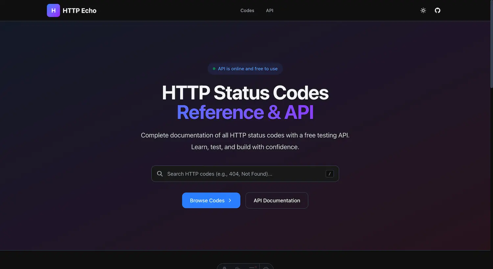

<div align="center">

# HTTP Echo

**Complete HTTP Status Code Reference & Free Testing API**

Learn about every HTTP status code. Test any status with a single request.
Fast, developer-friendly, and always available.

[](https://http.uncodigo.com)
[](https://astro.build)
[](https://tailwindcss.com)
[](https://pages.cloudflare.com)

<br />



</div>

---

## Features

- **60+ Status Codes** — Complete reference from 1xx to 5xx, including non-standard codes (nginx, Cloudflare), with RFC links, real-world usage, and examples
- **Free Testing API** — Send a request to `/http/{code}` and get that exact status code back, with JSON metadata
- **Interactive Tester** — Try any code directly from the browser with the built-in "Try It" widget
- **Search** — Find codes instantly by number, name, or description with keyboard shortcut (`/`)
- **Dark & Light Mode** — Automatic detection with manual toggle, persisted in localStorage
- **Edge-Deployed** — Runs on Cloudflare's global network for sub-millisecond latency
- **CORS Enabled** — Use the API from any origin, any HTTP method
- **Fully Responsive** — Optimized for desktop, tablet, and mobile

---

## Quick Start

```bash
# Get a 200 OK
curl https://http.uncodigo.com/http/200

# Test a 404 Not Found
curl https://http.uncodigo.com/http/404

# Simulate a slow server (2s delay)
curl "https://http.uncodigo.com/http/200?delay=2000"

# Custom redirect destination
curl -i "https://http.uncodigo.com/http/301?redirect_to=https://example.com"

# Rate limit with Retry-After
curl -i "https://http.uncodigo.com/http/429?retry_after=60"
```

---

## API Reference

### Base URL

```
https://http.uncodigo.com
```

### Endpoints

All standard HTTP methods are supported:

| Method | Path | Description |
|--------|------|-------------|
| `GET` `POST` `PUT` `DELETE` `PATCH` | `/http/{code}` | Returns the requested status code with JSON body |
| `HEAD` | `/http/{code}` | Returns headers only (no body) |
| `OPTIONS` | `/http/{code}` | Returns CORS preflight headers |

### Query Parameters

| Parameter | Type | Description | Example |
|-----------|------|-------------|---------|
| `delay` | `number` (ms) | Delay response, max 30000 | `?delay=2000` |
| `body` | `string` | Custom response body | `?body=Hello` |
| `content_type` | `string` | Custom Content-Type header | `?content_type=text/plain` |
| `headers` | `JSON` | Additional response headers | `?headers={"X-Custom":"value"}` |
| `redirect_to` | `string` | Destination URL for 3xx codes | `?redirect_to=https://example.com` |
| `no_redirect` | `flag` | Return JSON instead of redirecting (3xx) | `?no_redirect` |
| `retry_after` | `number` | Retry-After header for 429/503 | `?retry_after=60` |
| `allow` | `string` | Allowed methods for 405 | `?allow=GET,POST` |

### Response Format

```json
{
  "code": 404,
  "name": "Not Found",
  "description": "The requested resource could not be found...",
  "spec": "RFC 9110, Section 15.5.5",
  "request": {
    "method": "GET",
    "url": "https://http.uncodigo.com/http/404",
    "headers": { "accept": "*/*", "host": "http.uncodigo.com" }
  }
}
```

### Special Behaviors

| Code | Behavior |
|------|----------|
| **1xx** | Returned as `200` with `X-Original-Status` header (1xx cannot be final HTTP responses) |
| **204 / 304** | No body |
| **3xx** | Sends `Location` header (use `?no_redirect` to get JSON instead) |
| **401** | Adds `WWW-Authenticate: Bearer` |
| **405** | Adds `Allow` header |
| **429 / 503** | Supports `Retry-After` via `?retry_after=` |
| **444** | Empty response, closes connection (nginx behavior) |

### Code Examples

<details>
<summary><strong>JavaScript (fetch)</strong></summary>

```javascript
const response = await fetch('https://http.uncodigo.com/http/404');
console.log(response.status); // 404
const data = await response.json();
console.log(data);
```

</details>

<details>
<summary><strong>Python (requests)</strong></summary>

```python
import requests

response = requests.get('https://http.uncodigo.com/http/500')
print(response.status_code)  # 500
print(response.json())
```

</details>

<details>
<summary><strong>Go</strong></summary>

```go
resp, err := http.Get("https://http.uncodigo.com/http/418")
if err != nil {
    panic(err)
}
defer resp.Body.Close()

body, _ := io.ReadAll(resp.Body)
fmt.Printf("Status: %d\nBody: %s\n", resp.StatusCode, body)
```

</details>

---

## HTTP Codes Covered

| Category | Codes |
|----------|-------|
| **1xx** Informational | 100, 101, 102, 103 |
| **2xx** Success | 200, 201, 202, 203, 204, 205, 206, 207, 208, 226 |
| **3xx** Redirection | 300, 301, 302, 303, 304, 305, 307, 308 |
| **4xx** Client Error | 400-418, 420, 421-426, 428, 429, 431, 451 |
| **5xx** Server Error | 500-511, 444, 499, 529, 530, 598, 599 |

---

## Development

### Prerequisites

- Node.js >= 22.12
- npm

### Setup

```bash
git clone https://github.com/yourusername/httpecho.git
cd httpecho
npm install
npm run dev
```

### Scripts

| Command | Description |
|---------|-------------|
| `npm run dev` | Start dev server with HMR |
| `npm run build` | Production build (static + SSR) |
| `npm run preview` | Preview production build locally |
| `npm run deploy` | Build and deploy to Cloudflare Pages |

### Project Structure

```
src/
├── components/           # Reusable Astro components
│   ├── Header.astro      # Sticky nav, theme toggle, mobile menu
│   ├── Footer.astro      # 4-column footer with links
│   ├── SearchBar.astro   # Search with keyboard shortcut (/)
│   ├── CodeCard.astro    # Status code card with category colors
│   ├── CopyButton.astro  # Copy-to-clipboard with toast
│   └── TryIt.astro       # Interactive API tester widget
├── data/
│   └── http-codes.ts     # 60+ HTTP codes with full metadata
├── layouts/
│   └── BaseLayout.astro  # HTML shell, meta tags, OG, JSON-LD
├── pages/
│   ├── index.astro       # Homepage (prerendered)
│   ├── 404.astro         # Custom 404 page
│   ├── sitemap.xml.ts    # Dynamic sitemap generator
│   ├── codes/
│   │   ├── index.astro   # Browsable codes list with search
│   │   └── [code].astro  # Code detail: docs, try it, related
│   ├── docs/
│   │   └── index.astro   # Full API documentation
│   └── http/
│       └── [code].ts     # API endpoint (SSR, Cloudflare Workers)
└── styles/
    └── global.css        # Tailwind v4, CSS vars, dark mode
```

### Deployment

**Option 1 — Wrangler CLI:**

```bash
npm run deploy
```

**Option 2 — GitHub Integration (recommended):**

1. Connect your repository to Cloudflare Pages
2. Build command: `npm run build`
3. Output directory: `dist`
4. Environment variable: `NODE_VERSION=22`

---

## Tech Stack

| Layer | Technology |
|-------|-----------|
| Framework | [Astro](https://astro.build) v6 (hybrid SSR + prerender) |
| Styling | [Tailwind CSS](https://tailwindcss.com) v4 + [Typography](https://github.com/tailwindlabs/tailwindcss-typography) |
| Adapter | [@astrojs/cloudflare](https://docs.astro.build/en/guides/integrations-guide/cloudflare/) v13 |
| Hosting | [Cloudflare Pages](https://pages.cloudflare.com/) + Workers |
| Runtime | Node.js 22+ / Cloudflare Workers |

---

## License

MIT

## Contributing

Contributions are welcome! Feel free to open an issue or submit a Pull Request.
